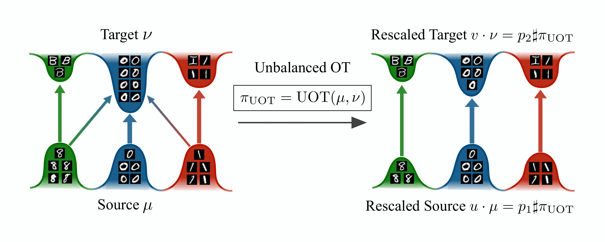
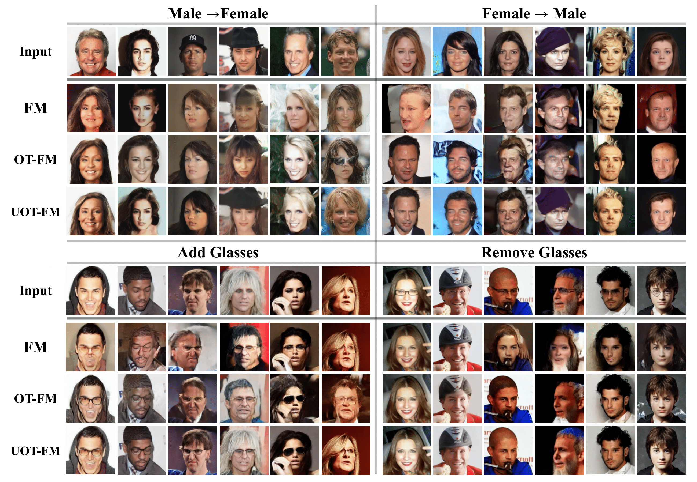

# "Unbalancedness in Neural Monge Maps Improves Unpaired Domain Translation" [ICLR 2024]

__Authors__: Luca Eyring*, Dominik Klein*, Théo Uscidda*, Giovanni Palla, Niki Kilbertus, Zeynep Akata, Fabian Theis

[](https://arxiv.org/abs/2311.15100)

We have split up the codebase for each method into one repository as follows:
- This repositoriy contains all `Flow Matching` experiments implemented leveraging `Jax`, `Equinox`, and `ott-jax`.
- The code for the single-cell trajcetory inference experiments using `OT-ICNN` can be found at https://github.com/theislab/moscot_not.
- For the single-cell pertubations experiments using `Monge Gap`, we plan to release the code soon.

Additionally, we're currently in the progress of implementing our methods into [ott-jax](https://github.com/ott-jax/ott/pull/468).

---


## Overview
- [Abstract](#abstract)
- [Setup](#setup)
   - [Environment](#environment)
   - [Datasets](#datasets)
- [Experiments](#experiments)
   - [Training](#training)
   - [Evaluation](#evaluation)
- [Citation](#citation)

### Abstract

In optimal transport (OT), a Monge map is known as a mapping that transports a source distribution to a target distribution in the most cost-efficient way. Recently, multiple neural estimators for Monge maps have been developed and applied in diverse unpaired domain translation tasks, e.g. in single-cell biology and computer vision. However, the classic OT framework enforces mass conservation, which makes it prone to outliers and limits its applicability in real-world scenarios. The latter can be particularly harmful in OT domain translation tasks, where the relative position of a sample within a distribution is explicitly taken into account. While unbalanced OT tackles this challenge in the discrete setting, its integration into neural Monge map estimators has received limited attention. We propose a theoretically grounded method to incorporate unbalancedness into any Monge map estimator. We improve existing estimators to model cell trajectories over time and to predict cellular responses to perturbations. Moreover, our approach seamlessly integrates with the OT flow matching (OT-FM) framework. While we show that OT-FM performs competitively in image translation, we further improve performance by incorporating unbalancedness (UOT-FM), which better preserves relevant features. We hence establish UOT-FM as a principled method for unpaired image translation.



---

## Setup
### Conda Environment
We assume GPU access for all experiments. The following will install the conda environment including `Jax` with `Cuda`.
```
conda env create -f environment.yml
conda activate uot-fm
conda install cuda-nvcc -c nvidia
```

### Datasets

#### EMNIST
Download and unpack the EMNIST dataset from [here](https://www.kaggle.com/datasets/crawford/emnist). Afterwards move the downloaded `archive` into `data/emnist` and run:

```
cd data/emnist
conda activate uot-fm
python preprocess_emnist.py
```
This saves the subset of EMNIST we consider in our experiments, with source digits `{0,1,8}` and target letters `{O,I,B}`.

#### CelebA
Download the CelebA dataset from [here](https://drive.google.com/drive/folders/0B7EVK8r0v71pWEZsZE9oNnFzTm8?resourcekey=0-5BR16BdXnb8hVj6CNHKzLg). Download and unpack `Img/img_align_celeba.zip` as well as `Eval/list_eval_partition.txt` and `Anno/list_attr_celeba.txt`, and move all of them into `data/celeba`.

After downloading both datasets your data folder should include the following:
```
├── data
│   ├── emnist
│   │   ├── x_train.npy
│   │   ├── x_test.npy
│   │   ├── y_train.npy
│   │   ├── y_test.npy
│   ├── celeba
│   │   ├── img_align_celeba
│   │   │   ├── [000001.jpg | 000002.jpg | ...]
│   │   ├── list_attr_celeba.txt
│   │   ├── list_eval_partition.txt
```

#### FID reference statistics 
We use the FID implementation provided by [jax-fid](https://github.com/matthias-wright/jax-fid). We precompute all reference statistics needed for the FID computation for `EMNIST`, `CIFAR10`, and `CelebA`. To do this, run

```
python compute_fid_reference_stats.py
```
This will compute reference statistics for both full datasets, as well as the attribute-wise ones we consider in the paper.
## Experiments
We rely on nested [ml-collections](https://github.com/google/ml_collections) to configure all experiments, which you can find in `/configs`. These are structured in the following way:

```
├── configs
│   │── base_config.py
│   │── base_fm.py
│   │── base_otfm.py
│   │── base_uotfm.py
│   │── dataset_one
│   │   ├── base_dataset.py
│   │   ├── base_architecture.py
│   │   ├── fm.py
│   │   ├── otfm.py
│   │   ├── uotfm.py
│   ├── dataset_two
│   │   ...
```

Here, `base_config.py` defines settings set for all experiments like checkpointing and some training and evaluation details. Then, `base_(u(ot))fm.py` sets the standard setting for the corresponding Flow Matching training. For each dataset, `base_dataset.py` and `base_architecture.py` set all the corresponding parameters. Lastly, `(u(ot))fm.py` combine the provided `base_` configs into one setting for an experiment. Here, `config.name` is changed for each experiment.

##### Logging
We leverage `wandb` for logging. Set your wandb key either through the enviornment variable `WANDB_API_KEY` or directly in `base_config.py`. Additionally, you can optionally specify a wandb group and entity in `base_config.py`.

### Training
Training results from the paper can be reproduced by calling `main.py` and specifying a config file. The configs for each dataset and method can be found in the corresponding dataset folder. E.g. to train `UOT-FM` on `EMNIST` run:

```
python main.py --config=configs/emnist/uotfm.py
```

or for `UOT-FM` with `tau=0.99` on `CIFAR10`:

```
python main.py --config=configs/cifar10/uotfm_tau99.py
```

`CelebA` includes two folders for the 256x256 version trained with Flow Matching in latent space, and the 64x64 version trained in pixel-space, as well as four sub-folders each for the different tasks. E.g. to train on `CelebA-256` translating `no-glasses -> glasses` with `OT-FM`, run:

```
python main.py --config=configs/celeba256/add_glasses/otfm.py
```

Parameters can be changed by either directly passing them or by creating/editing new configs. To reproduce the results from Appendix C.3 on the effect of different batch-sizes, can e.g. be done by:

```
python main.py --config=configs/emnist/uotfm.py --config.training.batch_size=512 --config.training.iterations=250000 --config.name="uot-fm_emnist_bs512"
```

Note, that here we also adjust the number of iterations such that the total amount of seen images will stay the same during training.

By default, all models will be evaluated every `config.training.eval_freq` iterations during training.




### Evaluation
To further evaluate a model, only evaluation can be run by adding mode `"eval"` as follows:

```
python main.py --mode="eval" --config=configs/celeba256/male/uotfm.py
```

By default, this will load the best checkpoint with respect to the specified metric during training. Other checkpoints at iteration `x` can be evaluated by passing `config.eval.checkpoint_step=x`.

To evaluate a trained model with a low-cost solver, as in Appendix C.2, run:

```
python main.py --mode="eval" --config=configs/celeba256/female/uotfm.py --config.solver="euler" --config.dt0=0.05
```

When `dt0` is specified the solver uses a constant stepize with a total of `1/dt0` steps, in this case resulting in 20 function evaluations.


## Citation

```bibtex
@inproceedings{eyring2024unbalancedness,
    title={Unbalancedness in Neural Monge Maps Improves Unpaired Domain Translation},
    author={Luca Eyring and Dominik Klein and Th{\'e}o Uscidda and Giovanni Palla and Niki Kilbertus and Zeynep Akata and Fabian J Theis},
    booktitle={The Twelfth International Conference on Learning Representations},
    year={2024},
    url={https://openreview.net/forum?id=2UnCj3jeao}
}
```
